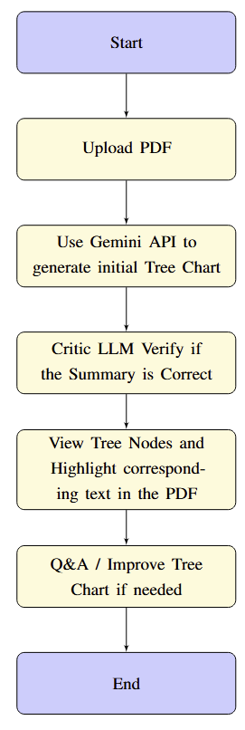

# paper-assistant

 Please change the **KEY** in chat.js first to use the Gemini 1.5 Flash API. 
 You can follow the workflow to check.

  

 #### `src/components/`

 1. **`chat.js`**: You should change the **KEY** in this file before running
 2. **`viewer.js`**: PFD viewer
 
